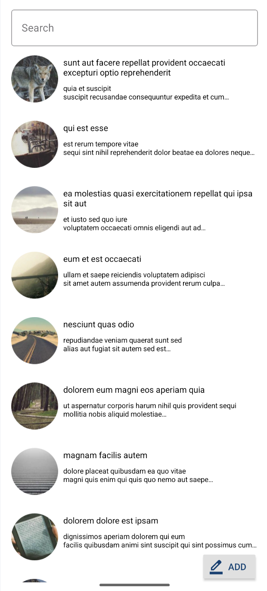
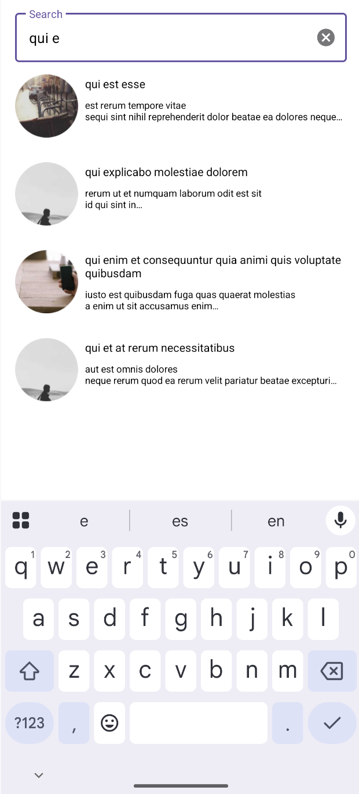
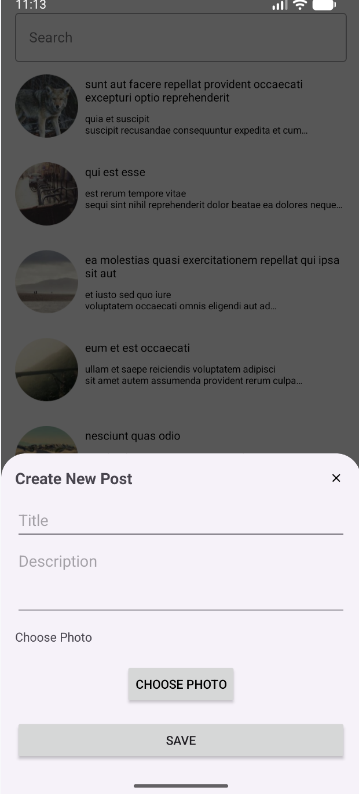
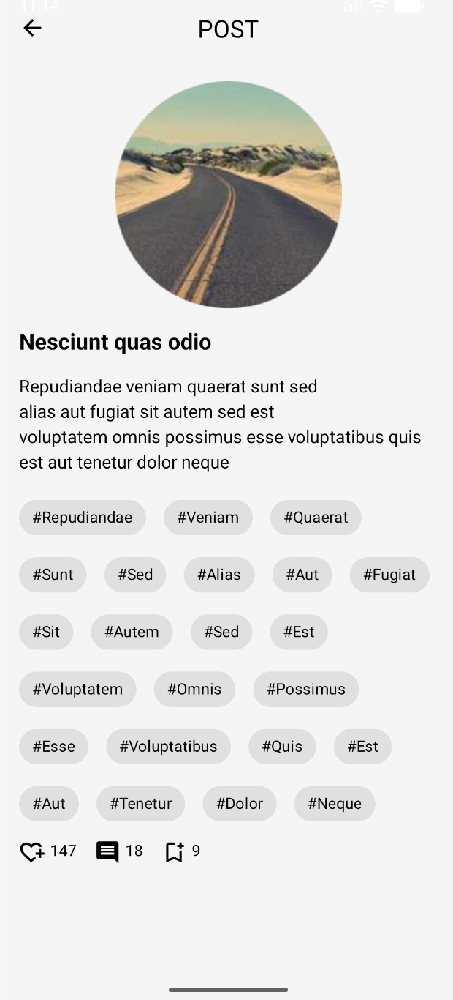

# Android Flow Post

Android Flow Post is a data listing and filtering application developed using the **MVVM (Model–View–ViewModel)** architecture pattern. Data fetched from a remote API is delivered to the UI through an **asynchronous data flow**, ensuring a responsive, scalable, and lifecycle-aware user experience.

## 🚀 Screenshots

    
    
    
    

---

## 🛠 Technologies & Libraries

The application leverages modern Android development tools with a strong focus on **performance, scalability, and maintainability**:

- **Architecture:** MVVM (Model–View–ViewModel)
- **Dependency Injection:** Dagger Hilt
- **Networking:** Retrofit & OkHttp
- **Navigation:** Jetpack Navigation Component for fragment navigation and type-safe argument passing via Safe Args
- **Image Loading:** Coil for efficient image loading and caching
- **UI:** XML-based layouts with View Binding

